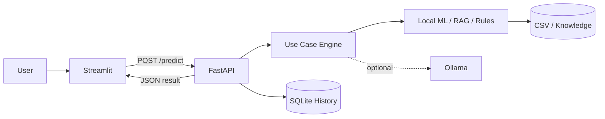

# Architecture

## Design Choices

- **FastAPI** provides a typed, testable backend contract.
- **Streamlit** makes the project immediately usable without a separate JavaScript build chain.
- **SQLite** demonstrates persistence and auditability with minimal setup.
- **scikit-learn / TF-IDF / deterministic rules** provide a local baseline that runs without paid APIs.
- **Ollama** is optional for local generative responses.
- **Human-in-the-loop defaults** are used for actions that could have business impact.

## Production Extensions

Replace local components with the services appropriate to your environment: SSO, API gateway, managed database, event streaming, model registry, vector database, secrets manager, observability, CI/CD, policy controls, and enterprise systems of record.
