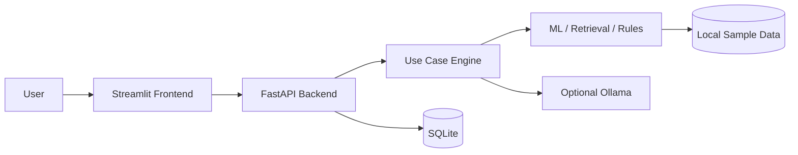

# AI Industry End-to-End Projects

A hands-on repository of **3,690 complete AI application projects** across **123 industries**.

Every industry has its own folder. Every use case is a standalone project containing:

- FastAPI backend
- Streamlit frontend
- SQLite persistence
- Local ML / retrieval / rule-based AI implementation
- Optional Ollama integration for local generative AI
- Sample data and seed scripts
- Automated API tests
- Architecture and API documentation
- Environment configuration
- Step-by-step run instructions
- Extensive inline comments in the source code

> The repository intentionally uses a common engineering pattern so learners can focus on how the **business problem, data, model behavior, API, UI, and workflow** change from project to project.

## Repository Structure

```text
ai-industry-end-to-end-projects/
├── README.md
├── PROJECT_INDEX.md
├── catalog.json
├── scripts/
│   └── verify_repository.py
└── industries/
    ├── 001-accounting-and-auditing/
    │   ├── README.md
    │   ├── 01-knowledge-assistant-rag/
    │   ├── 02-document-intelligence-extraction/
    │   └── ...
    └── ...
```

## Standard Project Architecture



## Quick Start

Choose any use-case folder, then:

```bash
python -m venv .venv
source .venv/bin/activate              # Windows: .venv\Scripts\activate
pip install -r requirements.txt
python scripts/seed_db.py
python scripts/run_backend.py
```

Open another terminal in the same project:

```bash
source .venv/bin/activate              # Windows: .venv\Scripts\activate
streamlit run frontend/app.py
```

Backend docs: `http://127.0.0.1:8000/docs`  
Frontend: `http://localhost:8501`

## Local Generative AI

The code runs without a hosted API. If Ollama is available locally, copy `.env.example` to `.env`, set `USE_OLLAMA=true`, and ensure the configured model exists. If Ollama is unavailable, projects fall back to deterministic local behavior so the full application remains runnable.

## Learning Path

For each project, work through:

1. Business problem and success metrics
2. Data contract and sample data
3. AI/ML approach
4. Backend API
5. Persistence
6. Frontend user experience
7. Testing
8. Security and production considerations
9. Extension ideas

## Scope

AI use cases are effectively unbounded. This repository provides a **large implementation baseline** using twelve reusable enterprise AI patterns in every listed industry. `catalog.json` and `PROJECT_INDEX.md` make it easy to expand the collection further while preserving the same end-to-end structure.

## Courses

1. [`100 AI Agents in 100 Days 2026`](https://www.udemy.com/course/100-ai-agents/?referralCode=3105B8C637C6D4FF5A2A)  
2. [`AI Mastery Bootcamp 2026: Complete Guide with 1000 Projects`](https://www.udemy.com/course/ai-engineering-complete-bootcamp-masterclass/?referralCode=33E84933C8F123B4232A)  
3. [`Data Science & AI Advanced Full Course - From Zero to Pro`](https://www.udemy.com/course/data-science-mastery-complete-data-science-bootcamp-2025/?referralCode=408994D50F83E213E05F)  
4. [`Certified Chief AI Officer Program: AI Strategy & Governance`](https://www.udemy.com/course/chief-ai-officer-program-lead-ai-strategy-governance/?referralCode=2511AF03A47CE605B257)  
5. [`Certified Fusion 360 for Absolute Beginners`](https://www.udemy.com/course/fusion-360-for-beginners-design-real-world-products/?referralCode=0DF8BEAE84CA403DAC06)  
6. [`AI Browser Agents with Python & Playwright`](https://www.udemy.com/course/ai-browser-agents-with-python-playwright/?referralCode=529419689AB0B28918F3)  
7. [`Certified 7-Day AI Bootcamp: AI Apps, RAG, and AI Agents`](https://www.udemy.com/course/7-day-practical-ai-bootcamp-build-ai-apps-rag-and-agents/?referralCode=7579C860558F920123B9)  
8. [`Claude Fable 5 for Absolute Beginners`](https://www.udemy.com/course/claude-fable-5-for-absolute-beginners/?referralCode=C0D912A738AB8D4D2147)  
9. [`Build Certified Autonomous AI Systems in 4 Weeks`](https://www.udemy.com/course/build-autonomous-ai-systems-in-4-weeks/?referralCode=604BFD161D0CC6FE21EE)  
10. [`Certified AI Agents, RAG & MCP: 7-Day Builder Bootcamp`](https://www.udemy.com/course/ai-agents-rag-mcp-7-day-builder-bootcamp/?referralCode=94C38CDB60CD5245F664)  
11. [`12-Week AI Certification Program`](https://www.udemy.com/course/12-week-ai-certification-program/?referralCode=E6CF7AA81E2356D82ED2)  
12. [`7 Days Certified AI Agents with Python: Autonomous Apps`](https://www.udemy.com/course/certified-ai-agents-with-python-autonomous-apps-in-7-days/?referralCode=0CCC57EBF94C5C1AD3F5)  
13. [`7 Days RAG with Python: Build Chatbots That Talk to Data`](https://www.udemy.com/course/rag-with-python-build-chatbots-that-talk-to-your-data/?referralCode=202ECAA12AD450B3634B)  
14. [`Build Local AI Apps with Ollama, Python, and Streamlit`](https://www.udemy.com/course/build-local-ai-apps-with-ollama-python-and-streamlit/?referralCode=95BFB016CAA6AD0240B7)  
15. [`Hands-On Certified AI Governance Engineering with Python`](https://www.udemy.com/course/hands-on-ai-governance-engineering-with-python/?referralCode=6952754C87BC1DBCCDEA)  
16. [`AI Security Masterclass: Prompt Injection & LLM Security`](https://www.udemy.com/course/ai-security-masterclass-prompt-injection-llm-security/?referralCode=9C044CAF4B3AE5B96112)  
17. [`AI Agent Development with Python`](https://www.udemy.com/course/ai-agent-development-with-python/?referralCode=8FADCEF454F249E9131D)  
18. [`Certified Forward Deployed Engineer Mastery`](https://www.udemy.com/course/forward-deployed-engineer-mastery/?referralCode=CE6624B7C4B7540E2327)  
19. [`AI Engineering Bootcamp: Apps, RAG, Agents & MCP`](https://www.udemy.com/course/ai-engineering-bootcamp-apps-rag-agents-mcp/?referralCode=1D8A0C8F667009506E23)  
20. [`Cooking Up AI: From Basics to Agentic Systems`](https://www.udemy.com/course/cooking-up-ai-from-basics-to-agentic-systems/?referralCode=FF064A207E8C4D7D0FDD)  
21. [`AI Security & Governance Masterclass: Build, Attack & Defend`](https://www.udemy.com/course/ai-security-governance-masterclass-build-attack-defend/?referralCode=BADDE3C4FC39C1A1D13A)  
22. [`Claude Code for Enterprise Software Development`](https://www.udemy.com/course/claude-code-for-enterprise-software-development/?referralCode=9C917313167323D37349)  
23. [`AI-Powered SDLC: Vibe Coding to Agentic Engineering`](https://www.udemy.com/course/ai-powered-sdlc-vibe-coding-to-agentic-engineering/?referralCode=D34C870D2E4DD02A7A03)  
24. [`Claude CCA-F 2026: Labs, Scenarios & Exam Masterclass`](https://www.udemy.com/course/claude-cca-f-2026-labs-scenarios-exam-masterclass/?referralCode=8C5AD9AD46F11D156A10)  
25. [`Agentic AI Security & LLM Governance Career Bootcamp`](https://www.udemy.com/course/agentic-ai-security-llm-governance-career-bootcamp/?referralCode=089B7DAD852EB22EA3C3)  
26. [`Enterprise Generative AI Systems on Microsoft Azure`](https://www.udemy.com/course/enterprise-generative-ai-systems-on-microsoft-azure/?referralCode=635B3C75B74159B75D68)  
27. [`Enterprise Generative AI Systems on AWS Certification Course`](https://www.udemy.com/course/enterprise-generative-ai-systems-on-aws-certification-course/?referralCode=9193DBCEE8F624EE8942)  
28. [`Kimi K3 for Absolute Beginners`](https://www.udemy.com/course/kimi-k3-for-absolute-beginners/?referralCode=6FFE8AFF46D240BD00D5)  
29. [`100 Days of Python: From Beginner to AI Builder`](https://www.udemy.com/course/100-days-of-python-from-beginner-to-ai-builder/?referralCode=DDFD6497AA2BACB41A89)  
30. [`100 Web Development Projects in 100 Days`](https://www.udemy.com/course/100-web-development-projects-in-100-days/?referralCode=203D7694240F9593AC2D)  
31. [`100 Projects to Build Forward Deployed Engineers Portfolio`](https://www.udemy.com/course/100-projects-to-build-forward-deployed-engineers-portfolio/?referralCode=6BE6F98D5C75A8B56BF7)  
32. [`Quantum Physics to Quantum Computing Masterclass`](https://www.udemy.com/course/quantum-physics-to-quantum-computing-masterclass/?referralCode=1077C792870CE0E724B0)  
33. [`100 Days of Quantum Computing Coding`](https://www.udemy.com/course/100-days-of-quantum-computing-coding/?referralCode=F821A93716FB2BA1DE3D)  
34. [`Claude Agentic AI in Practice Certification Course`](https://www.udemy.com/course/claude-agentic-ai-in-practice-certification-course/?referralCode=D3447BC5C14229419B57)  
35. [`100 Days of AWS: From Cloud Basics to Real-World Mastery`](https://www.udemy.com/course/100-days-of-aws-from-cloud-basics-to-real-world-mastery/?referralCode=65CE2834A7F199025778)  
36. [`AI SEO 2026: GEO, AEO & AI Search Optimization`](https://www.udemy.com/course/ai-seo-2026-geo-aeo-ai-search-optimization/?referralCode=A46C361C384344827C07)  
37. [`AI Foundations for Professionals`](https://www.udemy.com/course/ai-foundations-for-professionals/?referralCode=20D3457ACEECECACADBA)  
38. [`Generative AI for Productivity`](https://www.udemy.com/course/generative-ai-for-productivity/?referralCode=2EC8970154F7DA461A08)  
39. [`Prompt Engineering Mastery`](https://www.udemy.com/course/prompt-engineering-mastery-x/?referralCode=6CD718A2D6ED39828EB7)  
40. [`AI Agents and Automation`](https://www.udemy.com/course/ai-agents-and-automation-b/?referralCode=509839347B1450499628)  
41. [`RAG for GenAI Applications`](https://www.udemy.com/course/rag-for-genai-applications/?referralCode=933F7E09F12850298433)  
42. [`Build AI Apps with Python`](https://www.udemy.com/course/build-ai-apps-with-python/?referralCode=57B0CC1C361EC256D99A)  
43. [`AI Governance and Security`](https://www.udemy.com/course/ai-governance-and-security/?referralCode=403554D028005354050B)  
44. [`AI for Business Leaders`](https://www.udemy.com/course/ai-for-business-leaders-r/?referralCode=0DE1DB3227A37E3BB25E)  
45. [`Machine Learning Foundations`](https://www.udemy.com/course/machine-learning-foundations/?referralCode=A45CE9034A42E7BA2AF1)  
46. [`Enterprise GenAI with RAG and Agents`](https://www.udemy.com/course/enterprise-genai-with-rag-and-agents/?referralCode=6DA9F7A3C2984A246B67)  
47. [`Viral Content Engine: Create Marketing People Want to Share`](https://www.udemy.com/course/viral-content-engine-create-marketing-people-want-to-share/?referralCode=F6B5D4D41F710FFE4981)  
48. [`AI-Powered Digital Marketing: Build Smarter Campaigns Faster`](https://www.udemy.com/course/ai-powered-digital-marketing-build-smarter-campaigns-faster/?referralCode=B760C28EAD1328BE3931)  
49. [`SEO to AEO: Rank Across Google, YouTube, TikTok, & AI Search`](https://www.udemy.com/course/seo-to-aeo-rank-across-google-youtube-tiktok-ai-search/?referralCode=7DC68992FFF8B4412BB5)  
50. [`Short-Form Video Marketing Masterclass for Brands & Creators`](https://www.udemy.com/course/short-form-video-marketing-masterclass-for-brands-creators/?referralCode=D1224E37AE47C3CB0BB4)  
51. [`Social Media Growth Hacks: Turn Posts Into Leads and Sales`](https://www.udemy.com/course/social-media-growth-hacks-turn-posts-into-leads-and-sales/?referralCode=D7A9C4454879BCA1343E)  
52. [`Email Marketing That Converts: Write Campaigns People Open`](https://www.udemy.com/course/email-marketing-that-converts-write-campaigns-people-open/?referralCode=786E73DF039BD4EA5041)  
53. [`High-Converting Funnel Marketing: Turn Clicks Into Customers`](https://www.udemy.com/course/high-converting-funnel-marketing-turn-clicks-into-customers/?referralCode=BF326BA269389BE50AD9)  
54. [`Trendjacking 101: Turn Viral Moments Into Brand Growth`](https://www.udemy.com/course/trendjacking-101-turn-viral-moments-into-brand-growth/?referralCode=EFD55B7FB2783211363D)  
55. [`Digital Marketing: Build a Full-Stack Growth System`](https://www.udemy.com/course/digital-marketing-build-a-full-stack-growth-system/?referralCode=7889C07B1AA4DB0CB9B3)  
56. [`Personal Brand Marketing: Build Authority and Audience`](https://www.udemy.com/course/personal-brand-marketing-build-authority-and-audience/?referralCode=01A323046C7691F34748)
